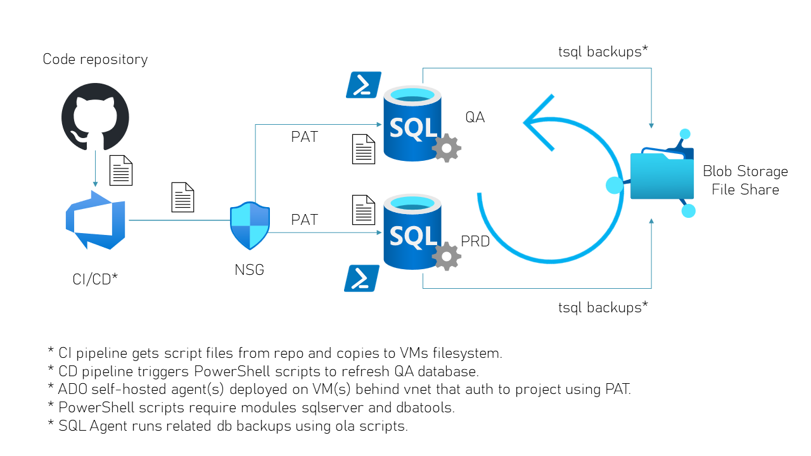
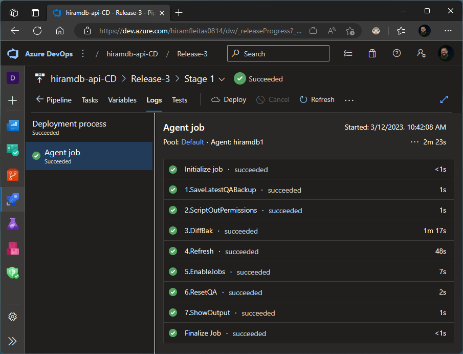

# GitHub + Azure DevOps integration
## RefreshQA userdb automated via devops

1. CI - Copies script files form Github repo to ADO Self-Hosted Agent Pool (Pool uses PAT auth).
2. CD - Runs several tasks to refresh userdb (ie. hriamdb), req. powershell modules [dbatools](https://dbatools.io) & [sqlsrver](https://learn.microsoft.com/sql/powershell/download-sql-server-ps-module).

### Successfully tested on:
- Windows Server 2016 & 2022
- Powershell & Pwsh 7
- IaaS: SQL Server 2019 & 2022

